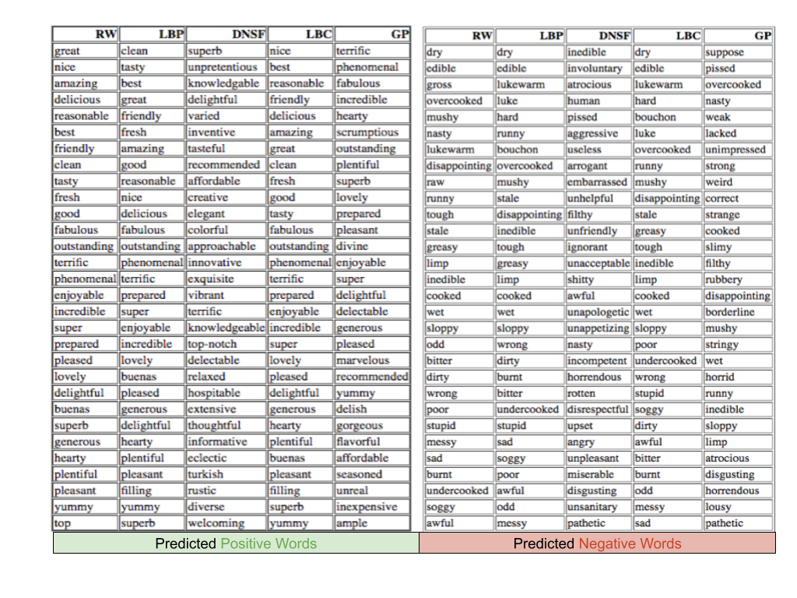
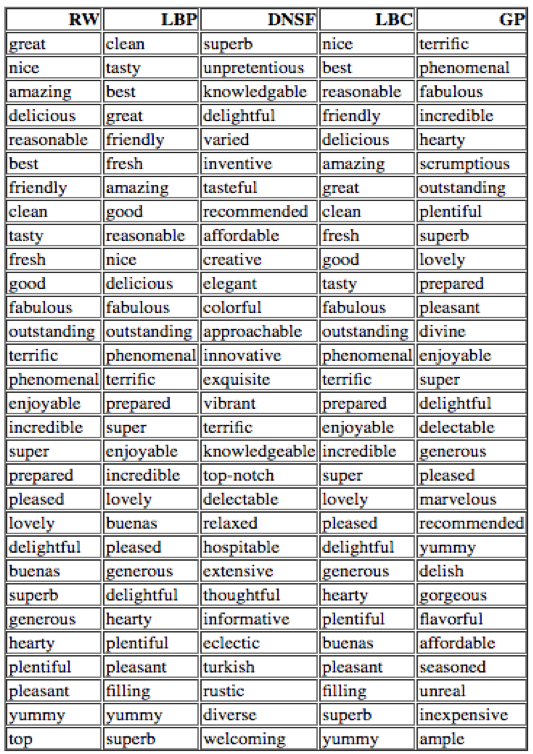
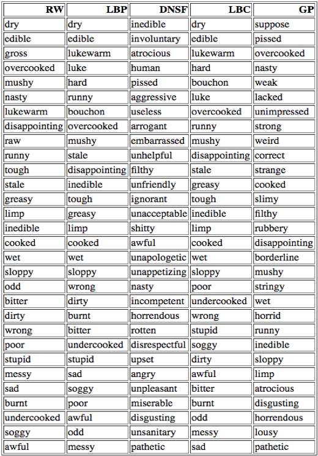
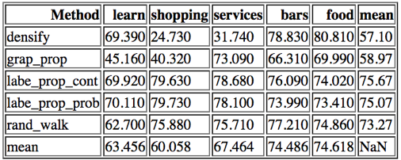
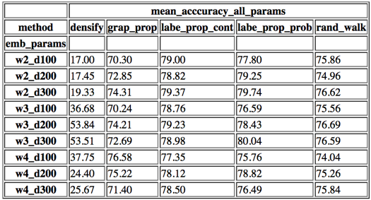
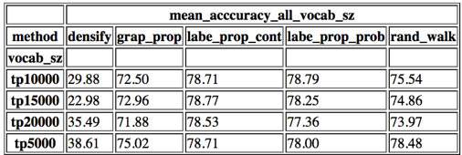

# Rating prediction for text reviews using automatically induced sentiment lexicon
Using  williamleif/socialsent to induce domain specific sentiment polarity dictionary and use it to predict rating based on text reviews

The accuracy of a dictionary based Sentiment Analysis algorithm is dependent directly on the lexicon used to interpret the polarity of the text in question. Different words often convey different meanings when put in different contexts, which is why a lexicon restricted to the study of interest is generated, often by putting in hundreds of person-hours and decades worth of domain expertise. A faster, and relatively automatic, approach towards the creation of such lexicon would, therefore, help speed up the process of opinion mining. In this project, we explore the applicability of an automatic method for constructing a domain-specific lexicon with minimal seed words and modestly sized vocabulary to rating prediction on user review texts obtained from a popular reviews website.

A common problem with using a corpus of standard opinion words for Sentiment Analaysis task is that those words may produce unreliable results in many cases as many words differ in meaning when they occur within different contexts. For example, the words “crazy” and “insane” when used to describe a person convey a negative connotation in contrast to when they they are used to describe an event in Sports. A domain-specific lexicon is therefore needed to achieve the best results. Another reason why a generic sentiment- lexicon has limited applicability is that, often, there are many words (and slangs) that are usually used only within a specific domain, and thus, a generic lexicon almost completely misses to encapsulate those. The most optimal results can only be seen if such a lexicon is manually constructed by humans - as humans have both - a much greater semantic understanding of the language and domain expertise - which is invaluable for such a task. However, human labour is expensive and the effort is very time-consuming, not to mention that it does not scale. To help automate this task, a lot of research has recently been carried out that tries to induce the required lexicon from a given corpus through the use of machine learning techniques and algorithms. 

### Using SocialSent

We use Socialsent - a software package written in the Python programming language that contains a collection of algorithms for performing lexicon extraction using only a few seed words as examples.

We use the package to induce sentiment lexicon (positive and negative words) for a dataset of Yelp user-reviews in 5 different categories.

  * Learning
  * Shopping
  * Bars
  * Services
  * Food

We observe the list of output tokens and their induced sentiment polarities and examine how the induction different algorithms fare in terms of predicting a reviewer’s expressed sentiment about an establishment as determined by the rating he/she gave with the review.

The Socialsent package provides an implementation of six different methods for inducing the polarities for words in vocabulary. The framework it uses - involves two steps: 

  * Constructing a lexical graph from word-embeddings learnt from an unlabelled corpus and
  * Propagating sentiment labels over this graph.

The details of the implementation can be found in [this paper (by Hamilton et al. 2016)](https://arxiv.org/abs/1606.02820)

#### Preprocessing and creating Word Embeddings

We did some pre-processing on the review texts in the form of keeping just the adjectives identified by the Penn Treebank POS tagger (available in the NLTK software package) and restricting the word-embeddings to be created only for those adjectives. We also used lemmatization to reduce every non-adjective word we encountered to its adjective base.

We constructed the Word2Vec embeddings from the user-reviews using the excellent Gensim python package. We also experiment with different settings for Word2Vec and observe the results. Due to memory constraints, we could only use top 20,000 (ordered by descending document frequencies) word-embeddings for this project for each category. In particular, we varied the window size for Word2Vec algorithm between 2,3 and 4, and the dimensions between 100 and 300 in one hundred increments. This gave us 9(3 for each window size multiplied by 3 for each embedding dim size) different datasets for each category to experiment with.

We also experimented with different vocabulary sizes - top 5000 words, top 10,000 words, top 15000 words and top 20,000 words. This gave us 20 datasets (4 for each vocab size multiplied by 5 categories) to experiment with.

Now we had 20 into 9 = 118 datasets on which to do our analysis.

The Socialsent package provides implementations for many different algorithms for inducing lexicon. We chose the following five for this project.

  * Label Propagation (probabilistic; named LBP in attached images)
  * Label Propagation (continuous; named as LBC in attached images)
  * Densifier (named DNSF in attached images)
  * Random Walk (named RW in attached images)
  * Graph Propagation (named GP in attached images))

We performed polarity induction for the aforementioned 118 datasets using each of the above algorithm. 

#### Seed Words

__Positive Seeds__

The following list of words were used as positive seed words

    good, great, delicious, best, nice, excellent, amazing, friendly, fresh, tasty, awesome, perfect, clean, fantastic, wonderful, reasonable, beautiful 

Negative Seeds

The following list of words were used as negative seed words

    disappointed, bad, wrong, terrible, worst, poor, awful, sad, soggy, ridiculous, dirty, odd, burnt, undercooked, bitter, stupid, messy 
    

Words were then ordered based on descending order of the mean of induced polarity over a run with all the nine different kinds of different Word2Vec embeddings.

Examples of Top 30 positive polarity words induced by the different algorithms are shown below

Examples of Top 30 negative polarity words induced by the different algorithms are shown below

#### Evaluation of Word Polarities

We measured the accuracy of induced word polarities by calculating a sentiment score for each of the review texts and comparing them with the user-provided rating on a scale of 1-5. For a review to be correctly classified in our evaluation, we used the following simple rules. If a review’s associated user-rating was greater than 3 and our calculated polarity for review was positive, we marked it as being correctly classified. Also, if a review’s associated user-rating was less than or equal to 3 and our calculated polarity for review was negative, we marked it as being classified correctly. Otherwise, the review was marked as being incorrectly classified.

For reference, number of reviews in the five categories were - food (1271504 reviews), bars (144623 reviews), services (224022 reviews), shopping (94620 reviews) and learning (91668 reviews).

The folowing figure shows the mean accuracy achieved by each of the algorithms. 

  
It can be observed that overall label propagation methods outperformed all the other methods for our corpus. They also performed most consistently for all review categories. The densifier method produced the highest accuracy for “food” and “bars” category as compared to all other methods but failed badly when predicting sentiments for “shopping” and “services” category. Graph propagate fared in a similar fashion. The random walk method was also relatively consistent in its performance in all of the categories except “learn” where all of the other methods struggled to correctly rate reviews.

#### Effects of Word2Vec settings

The following image shows how different settings of the Word2vec algorithm affect the accuracy of different algorithms for reviews in the “services” category. Each setting's name is formatted as w[window-size]_d[embedding-dim-size]" 

#### Effects of Vocab size

The following image shows how size of the vocabulary affect the accuracy of different algorithms. 

We found that all the algorithms in the Socialsent package do a good job on automatically inducing polarities for all words in a given corpus. We also found that many of the methods produce contrasting polarities for many words in the corpus, so the output vocabulary needs a little bit of cleaning before it should be used. Nevertheless, the package does save the researcher a lot of time. 
